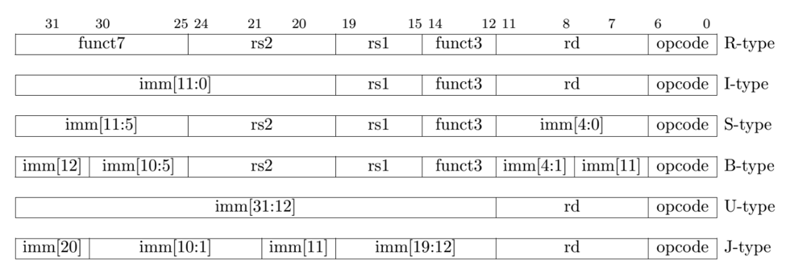

# RISC-V-32-bit-pipelined-cpu
RISC-V 32-bit Pipelined Processor - Subset RV32I

- Pipeline registers fixed
- Updated hazard detect unit ( check lw ) and forwarding unit 
- Updated immediate calculation based on RISC_V architecture
